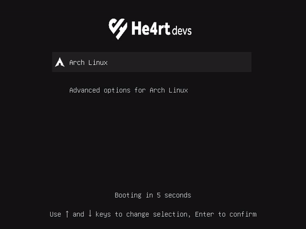

# He4rt GRUB theme

  

    

---
## Instalação
1. Faça o download do repositóri, descompacte o arquivo e mova a pasta para `/boot/grub/themes`.
2. Altere a variavel `GRUB_THEME=` para `GRUB_THEME=/boot/grub/themes/he4rt-grub-theme/theme.txt` no arquivo `/etc/default/grub`.
3. Execute o comando `grub-mkconfig -o /boot/grub/grub.cfg`.
4. Reinicie seu computador e pronto ja tem o tema da [He4rt](https://heartdevs.com/) no seu GRUB!

----
**Lucas Silva (LucasHe4rt)** - *Developer & Member of He4rt Developers* - [Twitter](https://twitter.com/lucashe4rt)

Made with 💜

